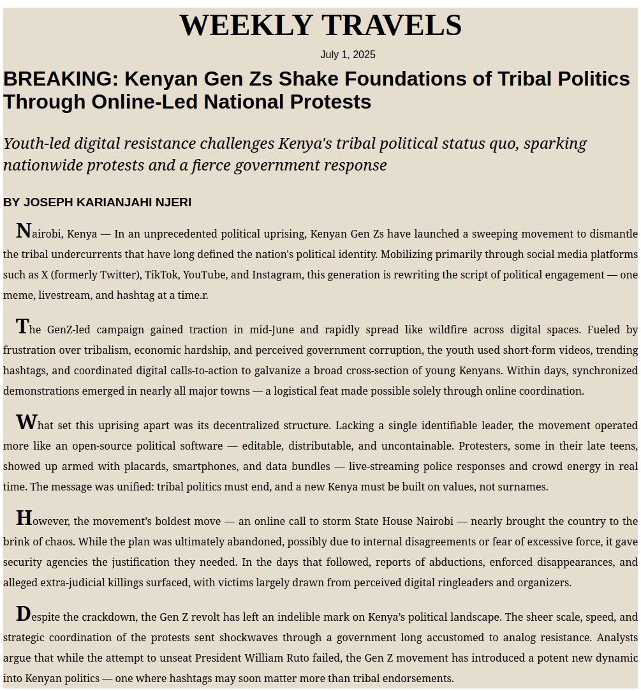

# Breaking News Article — Gen Zs Challenge Tribal Politics in Kenya

This project presents a breaking news-style webpage reporting on the digital uprising led by Kenya's Generation Z to challenge entrenched tribal politics. Written in semantic HTML and styled with CSS, the layout emulates a traditional newspaper while offering a responsive and readable modern design.

## 📰 Headline

**BREAKING: Kenyan Gen Zs Shake Foundations of Tribal Politics Through Online-Led National Protests**

**Sub-headline:**  
*Youth-led digital resistance challenges Kenya's tribal political status quo, sparking nationwide protests and a fierce government response*

## 📁 Project Structure

css-newspaper-article/
├── images/
│ └── preview.png # Screenshot preview of the newspaper article page
├── index.html # HTML file containing the article content
├── styles.css # CSS file containing newspaper-style formatting
├── .gitignore # Git ignore file for deployment
└── README.md # Project documentation

## 🌐 Technologies Used

- **HTML5**: Semantic elements (`<article>`, `<time>`, `
`, `
`) for clean document structure
- **CSS3**: Custom styles for typography, layout, and emphasis (including `::first-letter`, `text-indent`, `font-style`, and responsive formatting)
- **Google Fonts**: Open Sans for a readable print-style font

## 🖌️ Design Highlights

- Emulates a newspaper layout using background colors, indents, serif/sans-serif typography, and centered headers.
- Custom typography: Headline and sub-headline styled distinctively to separate visual hierarchy.
- `::first-letter` pseudo-element used to highlight the first letter of each paragraph, mimicking traditional print journalism.
- Fully responsive layout and semantic HTML for screen readers and accessibility.
- Author name and article date are styled to reflect professional news publishing standards.

## 🔍 Preview

## 🪪 Author

**Joseph Karianjahi Njeri**

## 📝 License

This project is licensed under the MIT License.  
Feel free to use, adapt, or share for personal, academic, or journalistic projects.

---

> ⚠️ To view the page correctly after cloning or downloading the repo, ensure both `index.html` and `styles.css` are in the root directory and your browser has access to the Open Sans font via the provided Google Fonts link.
